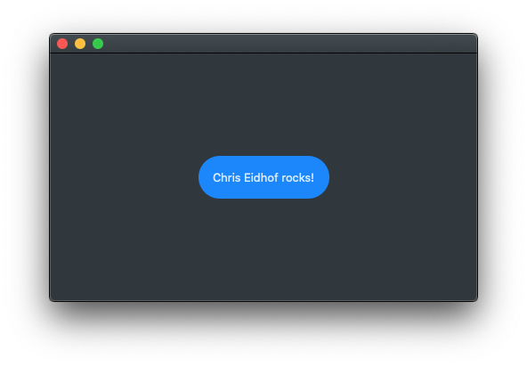

# QuickMacApp

This is a demo macOS application (graphic) using Swift Package Manager executable, with SwiftUI.

Base in [Chris Eidhof gist](https://gist.github.com/chriseidhof/26768f0b63fa3cdf8b46821e099df5ff) (100% his code).

### Main.swift

### Launching the app
Launch like any SwiftPM executable:

### Application UI

